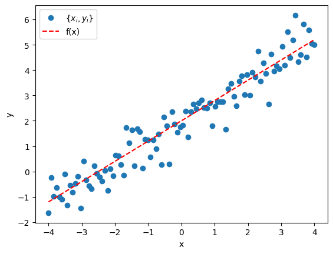
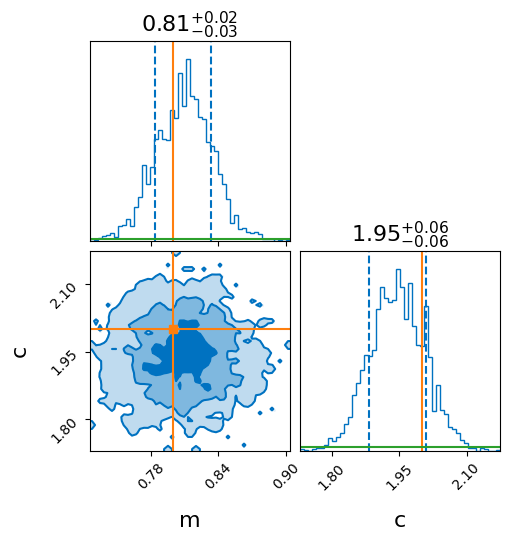
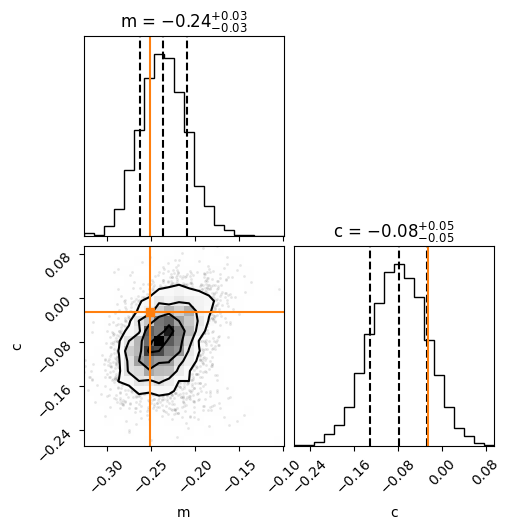
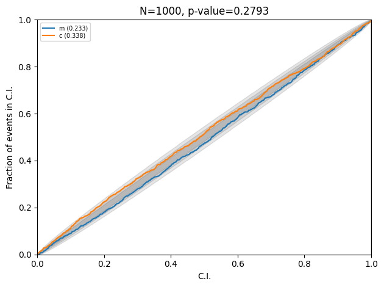

Normalizing flows have become very popular in recent years. An important application is
to obtain posteriors, which is otherwise done using stochastic sampling
techniques like markov-chain monte carlo (MCMC) or nested sampling. Here, is
a toy example of bayesian inference for a linear model, where the posterior is known
analytically.

# Linear model

Consider the straight line with a noise term,
\begin{align}
  y_i = \underbrace{mx_i + c}_{\text{true model }f(x_i)} + \epsilon_i.
\end{align}
Here $$\{m, c\}$$ are the model parameters for which we want posteriors. We
are given points $$\{y_i, x_i\}$$, and $$\epsilon \sim \mathcal{N}(0, \sigma^2)$$.

In this case the likelihood is,
\begin{align}
  L(\{y_i\}\vert \{x_i\}, m, c, \sigma)  \propto \exp\left[-\frac{1}{2\sigma^2}\sum_i\left(y_i - mx_i - c\right)^2\right].
\end{align}
The argument of the exponential is minimized at (for simplicity, I take $$\sum x_i = 0$$
i.e., say $$x_i \in [-a, a]$$, without loss of generality),
\begin{align}
  \hat{m} = \frac{\sum x_iy_i}{\sum x_i^2}\;\;\;;\;\; \hat{c} = \frac{\sum y_i}{n}.
\end{align}
These are the answers for a least square fit. Rewriting the likelihood, expanding around the
minima, the expression becomes,
\begin{align}
  L(\{y_i\}\vert \{x_i\}, m, c, \sigma) \propto \exp{\left[-\frac{\sum x_i^2}{2\sigma^2}\left(m - \hat{m}\right)^2\right]} \times
  \exp{\left[-\frac{n}{2\sigma^2}\left(c - \hat{c}\right)^2\right]}.
\end{align}
Here, I have left out terms that are constants etc. From the above, one can see the likelihood for $$m$$ and $$c$$ is
gaussian peaked at the least square values and corresponding widths are $$\left(\sigma/\sqrt{\sum x_i^2}\right)$$
and $$\left(\sigma/\sqrt{n}\right)$$.

The posterior can be obtained by multiplying and integrating the priors. Taking a flat prior i.e.,
$$p(m) \propto p(c) \propto 1$$ and assuming $$\sigma$$ is fixed i.e. delta function prior. The marginal posteriors
of $$m$$ and $$c$$ are the individual gaussians that appear in the likelihood above. For example, for $$m$$,

$$
\begin{align}
  p(m\vert \{y_i, x_i\}) &\propto 
  \int L(\{y_i\}\vert \{x_i\}, m, c, \sigma')\;\underbrace{p(m)\;p(c)}_{\sim 1}\;\overbrace{p(\sigma)}^{\sim \delta(\sigma - \sigma')} dc\;d\sigma' \\
  &\propto \exp{\left[-\frac{\sum x_i^2}{2\sigma^2}\left(m - \hat{m}\right)^2\right]}.
\end{align}
$$

In reality, the noise is not known, and $$p(\sigma)$$ is not a delta function. The natural choice is a flat prior, but
the integral cannot be done in closed form always. A special case is $$p(\sigma) \sim 1/\sigma^2$$, where substituting
$$z = 1/\sigma$$ will give the posterior as a $$t$$-distribution, but the peak and width (which is what I am interested)
are the same as delta-function prior case. Below, we get the same result from stochastic sampling, and then simulation based
inference using flows.

# Posterior using stochastic sampling

Let's do the same exercise using nested sampling. Here, I use `bilby`. Here, I am showing minimal code snippets to get the
idea across.

```python
import numpy as np

def linear_model(x, m, c):
    return m * x + c

# truth
injection_parameters = dict(m=0.8, c=2)
# std dev for the noise
sigma = 0.6

num_points = 100
x = np.linspace(-4, 4, num_points)
# sample points
data = linear_model(x, **injection_parameters) + np.random.normal(0, sigma, x.size)
```

The data looks like the following



Define likelihood and priors, run sampler, and get posterior.
```python
import bilby
from bilby.core.likelihood import GaussianLikelihood
from bilby.core.prior import Uniform

log_l = GaussianLikelihood(x, data, linear_model, sigma=sigma)

priors = dict()
priors['m'] = Uniform(-3, 3, name='m', latex_label='m')
priors['c'] = Uniform(-3, 3, name='c', latex_label='c')

result = bilby.run_sampler(
    likelihood=log_l, priors=priors, sampler='dynesty',
    nlive=300, npool=4, save=False, clean=True,
    injection_parameters=injection_parameters,
    outdir='./linear_regression',
    label='linear_regression'
)
```

Note in the above snippet that `sigma` is provided to the likelihood. This is the same
as "knowing" the noise, which is not true in reality. As mentioned in the above section,
there should be a prior on `sigma`. But it is fixed here to draw the parallel between
the first section where we put a $$\delta$$ function prior on $$\sigma$$. The posterior
looks like the following.



Note that the widths are consistent with that obtained analytically above. For this case,
I get `sigma / np.sqrt(np.sum((x)**2)) = 0.0257`, and `sigma / np.sqrt(num_points) = 0.06`,
which is consistent with the `+/-` values in the figure (need to use the 1-sigma
confidence intervals when plotting i.e. `quantiles=(0.16, 0.84)` in `bilby`.)

# Posterior using Masked Autoregressive flow

Let's do the same problem using a _flow_. I'll not go into detail of what a flow is. The two
key components of a flow are

- a *distribution*, which is assumed to a standard normal (hence _normalizing_ flow).
- a *transform*, which will take the input and transform it to the variables of the distribution.
This is the neural network that is trained. Importantly, it returns both the transformed point,
and the determinant of jacobian of the transformation.

The following is the basic idea of simulation based (likelihood free) inference.
- Generate data, $$\{y_i\}$$ for many different points on the prior, $${\bf{\Theta}} = \{m, c\}$$ here.
- Learn **the joint distribution**, $$p({\bf{\Theta}}, \{y_i\})$$. This is done by normalizing this distribution
i.e., the *transform* is learned during training.
- After learning, for new data $$\{y_i\}^{\text{new}}$$, the posterior is,

$$
\begin{align}
  p({\bf{\Theta}} \vert \{y_i\}^{\text{new}}) &= p({\bf{\Theta}}, \{y_i\})\times \delta(\{y_i\} - \{y_i\}^{\text{new}}) \times p({\bf{\Theta}}) \\
  &= p({\bf{\Theta}}, \{y_i\}^{\text{new}})\;p({\bf{\Theta}})
\end{align}
$$

Hence, practically, what this means is - sample different $${\bf{\Theta}} \sim p({\bf{\Theta}})$$. Fix data,
$$\{y_i\}^{\text{new}}$$, and pass the combination $${\bf{\Theta}}, \{y_i\}^{\text{new}}$$ through the trained
flow to get $$p({\bf{\Theta}}, \{y_i\}^{\text{new}})$$. This gives the weight of
every $${\bf{\Theta}}$$. Now the posterior is a weighted histogram.

Here, I am using the _autoregressive_ flow. The term is a detail of the _transform_. For purposes
here, it is suffice to know that it is a particular technique of transforming which is flexible.
Rewrite the data generator for convenience - it samples `m` and `c` from the prior and
generates `num_points` noisy data points.
```python
def get_data(m=None, c=None, num_points=1):
    """Sample m, c and return a batch of data with noise"""
    m = priors['m'].sample() if m is None else m
    c = priors['c'].sample() if c is None else c
    x = np.linspace(-4, 4, num_points)
    y = m*x + c
    y += sigma*np.random.normal(size=x.size)

    return x, y, m, c
```

Sample points from the prior, simulate data, and create datasets and dataloaders (I'll use `torch`).
```python
import torch
import torch.nn.functional as F
from torch.utils.data import Dataset, DataLoader

# simulate data
num_simulations = 10000
theta_vals = []
data_vals = []
for ii in range(num_simulations):
    x_val, y_val, m_val, c_val = get_data(num_points=100)
    data_vals.append(y_val)
    theta_vals.append([m_val, c_val])

# convert to torch tensors
theta_vals = torch.from_numpy(np.array(theta_vals)).to(torch.float32)
data_vals = torch.from_numpy(np.array(data_vals)).to(torch.float32)

# create dataset
class DataGenerator(Dataset):
    def __len__(self):
        return num_simulations

    def __getitem__(self, idx):
        if torch.is_tensor(idx):
            idx = idx.tolist()

        return theta_vals[idx], data_vals[idx]

dataset = DataGenerator()

# create dataloaders - 80/10/10 split
train_set_size = int(0.8 * num_simulations)
val_set_size = int(0.1 * num_simulations)
test_set_size = int(0.1 * num_simulations)

train_data, val_data, test_data = torch.utils.data.random_split(
    dataset, [train_set_size, val_set_size, test_set_size])

train_data_loader = DataLoader(
    train_data, batch_size=20,
    shuffle=True
)

val_data_loader = DataLoader(
    val_data, batch_size=20,
    shuffle=True
)

test_data_loader = DataLoader(
    test_data, batch_size=1,
    shuffle=False
)
```
Here, I'll train and validate using batches of `20` but the test samples are taken individually.

Define the flow (I use `nflows`).
```python
from nflows.distributions import StandardNormal
from nflows.transforms.autoregressive import MaskedAffineAutoregressiveTransform
from nflows.transforms import CompositeTransform, RandomPermutation

# the following three choices is related to the internal structure of the maf
# this is the minimum that gave quick convergence. Feel free to play around or optimize.
num_transforms = 5
num_blocks = 2
hidden_features = 50

context_features = 100  # because 100 data points

base_dist = StandardNormal([2])  # because 2-D posterior

transforms = []

for _ in range(num_transforms):
    block = [
        MaskedAffineAutoregressiveTransform(
                features=2,  # 2-dim posterior
                hidden_features=hidden_features,
                context_features=context_features,
                num_blocks=num_blocks,
                activation=torch.tanh,
                use_batch_norm=False,
                use_residual_blocks=False,
        ),
        RandomPermutation(features=2)
    ]
    transforms += block

transform = CompositeTransform(transforms)

flow = Flow(transform, base_dist)
```

Define optimizer and scheduler, and train.
```python
optimizer = optim.Adam(flow.parameters(), lr=1e-4)
scheduler = optim.lr_scheduler.ExponentialLR(optimizer, gamma=0.95)
```

I am skipping writing the full training loop, keeping the post short. I trained
for a fixed 100 epochs (takes few minutes). There are more sophisticated ways
to ensure convergence, and stop training instead of going a fixed number of epochs.

Now pass the test data to the flow and draw samples.
```python
for idx, (theta_test, data_test) in enumerate(test_data):
    with torch.no_grad():
        samples = flow.sample(5000, context=data_test.reshape((1, 100)))
    # do the plotting
```



Note the value of the widths, which is consistent with the analytic result.
Here is the PP plot after running the complete test data through the trained flow.



Injections are consistent with the posteriors.
